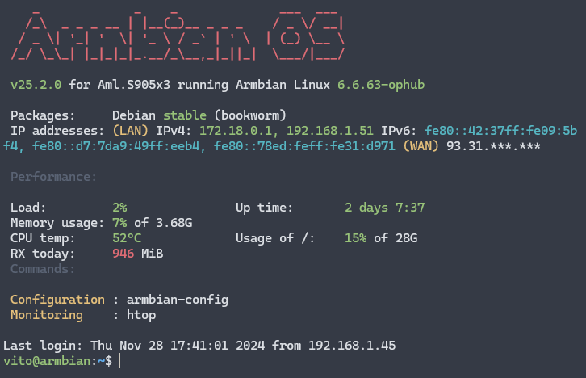
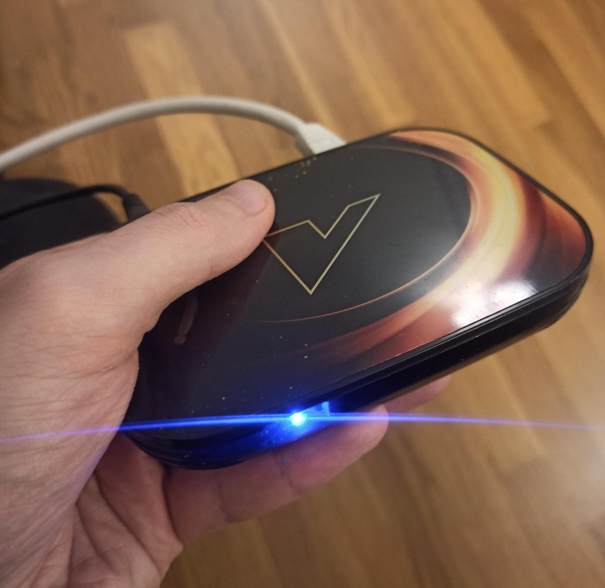

# Installing Armbian Linux on Vontar X3 TV box (or other s905 devices)

 A cheaper solution than Raspberry pi ! 

 For only 35/40$ (at the time of writing) you have a singleboard computer ! And no need to buy a case. 

This is how i installed Armbian on vontar x3 TV box. To use it as a linux server (or mini pc).

I hope this will help you 

## What do you need

- [A Vontar X3 TV box](https://s.click.aliexpress.com/e/_DEOTLuN)  (or any box having arm like S905 cpu ...) 
Choose a 4GB RAM version !  
- SD CARD (at least 16 GB) [i took this cheap one](https://s.click.aliexpress.com/e/_DdJnx9r) (a legit one, real size as shown)
- one toothpick
- one screen and hdmi cable for installation 

- Rufus (free software)

## Burn the image on the sd card with Rufus 

I used image from https://github.com/ophub/amlogic-s9xxx-armbian

This repo propose only server images, for desktop image, look here : https://github.com/armbian/community/releases

You can choose ubuntu or debian based image, 
I choosed debian based, and i pick the image for s905x3 (the cpu of Vontar-x3).

So i picked this image : Armbian_24.11.0_amlogic_s905x3_bookworm_6.6.62_server_2024.11.20.img.gz

Select your SD card and the image in Rufus, and burn it ! 🔥

## Prepare the boot files on sd card

### u-boot

Depending on your cpu you need to set the u-boot.ext file

If you don't have a vontar x3, find your corresponding files [here](https://github.com/ophub/amlogic-s9xxx-armbian/blob/main/build-armbian/armbian-files/common-files/etc/model_database.conf)

For Vontar x3, you have a s905x3, and you need u-boot-s905x2-s922 or u-boot-s905x3 

    cp u-boot-s905x2-s922.bin u-boot.ext 

### Device tree block 

For Vontar X3, you need this dtb file : meson-sm1-hk1box-vontar-x3.dtb.

For other devices, you can again fin your corresponding files [here](https://github.com/ophub/amlogic-s9xxx-armbian/blob/main/build-armbian/armbian-files/common-files/etc/model_database.conf).
If your device is not listed inside, you can try one dtb file that has same CPU, RAM memory, and same ethernet speed 

In extlinux/ dir, copy extlinux.conf.bak to extlinux.conf

Then edit the fdt line with the correct dtb file, for example :

    fdt /dtb/amlogic/meson-sm1-hk1box-vontar-x3.dtb

Do the same in uEnv.txt (i am not sure if it is need, but just in case)

## Boot on the sd card 

- Unplug your vontar x3
- Plug a screen with HDMI cable, to see what is going on
- Insert the SD card
- Use the toothpick to press the reset button, it should be inside the audio jack port
- Hold the button while you plug the power
- Wait for the install to complete on the screen

If this is not the correct dtb file, it will be stuck at "starting linux kernel". So try another one.

When linux is started, you can plug a keyboard to the box, or just an ethernet cable, and ssh to it (user : root, password: 1234, port: 22)

## Install on eMMC

Now your linux system is installed on the SD card.
You can install on the eMMC (inside memory) to have faster disk speed.
But be careful, it may brick your device, and you will lose access to the android firmware. 

Run : 

    armbian-install -m yes -a no

Enjoy your cheap linux server now ! 

Look at this cutie : 

## Performance benchmark

#### CPU  
CPU s905x3 is a bit slow ! 40 seconds to compute 5000 digit of pi 

    vito@armbian:~$ time echo "scale=5000; a(1)*4" | bc -l
    real    0m42.735s
    user    0m42.690s
    sys     0m0.008s

But this is enough to host some service like nextcloud (with a external usb hard drive), private DNS, VPN ...

Anything you would run on a Pi.

#### Disk 

Write speed : 713 MB/s ! EMMC is quite fast 

Read speed : 1,2 GB/s

#### Network 

Ethernet is 1000mbps so you can download and upload fastly

#### GPU 

GPU is powerful enough to decode 4K 60 fps hdr video, not so useful for a server i guess.

I use another Vontar X4 as a box tv, with CoreElec OS :) 

